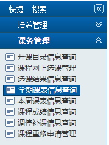

# bupt-kb-helper

这个脚本可以帮助来自北邮的研究生将课表导入到wakeup课程表中

## 准备工作

这个脚本需要使用`beautifulsoup`来对原始的html文件进行分析

`pip install beautifulsoup4`

## 获取你的课表页面源码

你需要登录自己的教务系统，并将源文件保存到项目目录下

- 登录研究生教务系统，并依次选择课务管理-学期课表查询

- 将网页另存为到项目根目录下。在win中，你可以按下ctrl+s来进行另存为操作，在mac下可能需要使用command+s。

> 另存为的文件可能不仅仅包含单个html，不要惊慌。

- 下载完成后，你的根目录会出现“北京邮电大学研究生信息数字化管理系统”的文件夹和单个html文件

## python脚本，启动！

直接在项目根目录运行python脚本，脚本会自动分析你的课表，并将结果输出到一个名为`kb.csv`的文件中。

`python main.py`

或者，你是一个比较厉害的人，你找到了含有课表的html文件，你也可以使用以下命令对课表进行分析。

`python main.py <html路径>`

## 导入课表到wakeup

点击下图的小按钮，选择从文件导入-从csv，将`kb.csv`导入

